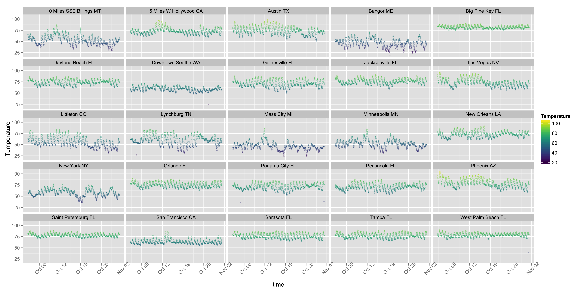

Weather Explorer
========================================================
author: Thom Savela
date: 12/24/2015

About the Siny Application
========================================================

This application helps users visualize weather data

- Multiple varialbes can explored
- Data from various locations 
- Rolling averages
- A time range option will be added in future release

Sample data: Saint Petersburg FL
========================================================

|time                | Temperature| Humidity| Pressure| Visibility| Wind_Speed| Dew_Point|
|:-------------------|-----------:|--------:|--------:|----------:|----------:|---------:|
|2015-10-01 04:00:00 |          82|       74|    29.76|         10|          8|        73|
|2015-10-01 05:00:00 |          82|       74|    29.74|         10|          6|        73|
|2015-10-01 06:00:00 |          81|       79|    29.73|         10|          5|        74|
|2015-10-01 07:00:00 |          81|       79|    29.71|         10|          3|        74|

Sample Chart
========================================================

Links
========================================================

* Data is collected via a [Spluk App](https://github.com/thomrs7/weather_station).
* The final apps code is on [github](https://github.com/thomrs7/data_products).
* A working demo can be found [here](https://thomrs7.shinyapps.io/data_products).
